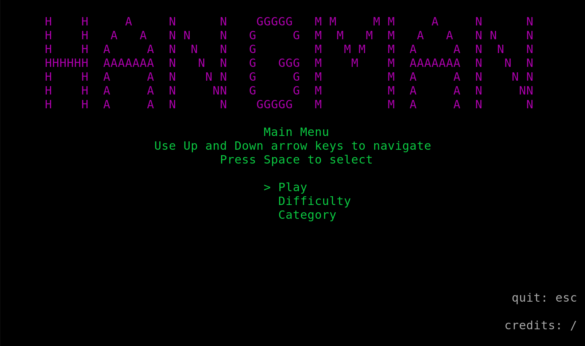
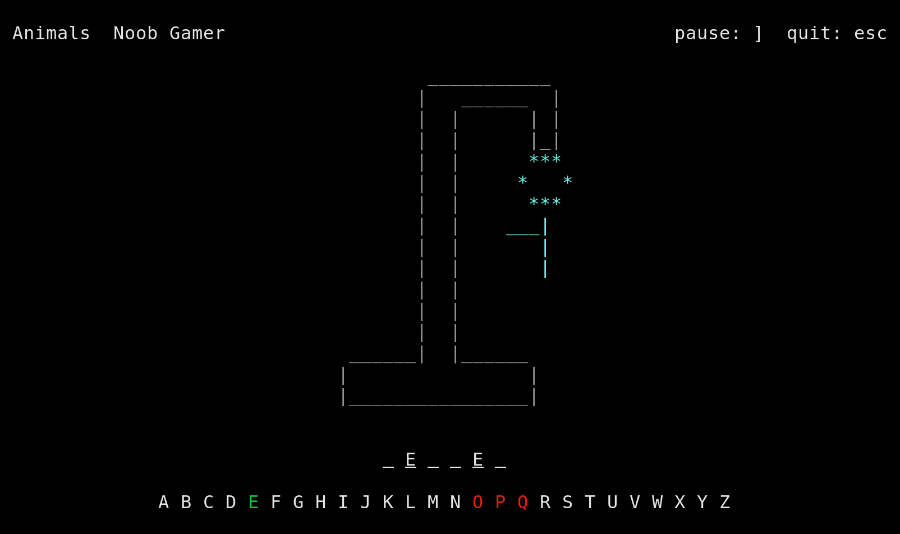

# hangman
a shell based hangman game written in C with ncurses

## Build
`gcc game.c credits.c hang.c menu.c -o hangman -lncurses`

## Run
`./hangman`

## Note
This game was built to work on Linux. It was never tested on Windows or Mac.

## About
This game was made as a college C programming class end-of-term group project. It is my first time doing a somewhat large program of any sort in C, and I'm quite pleased with it.

## Credits
### April
Game graphic design

### William
Game word bank

### [Viget website](https://www.viget.com/articles/game-programming-in-c-with-the-ncurses-library/)
Introducing us to ncurses.

### [Ncurses how to](https://tldp.org/HOWTO/NCURSES-Programming-HOWTO/index.html)
Very usefull guide on ncurses that should probably be read through thouroughly if doing anything with ncurses.

### [Ncurses quick guide](http://www.cs.ukzn.ac.za/~hughm/os/notes/ncurses.html)
Finally found how to take input from arrow keys so they wouldn't make the program exit.

### [Stack Overflow](https://stackoverflow.com/questions/16192087/undefined-reference-to-initscr-ncurses)
Apparently ncurses linkage is the very *last* thing that needs to be done when compiling the program.

### [Tech Lister](https://techlister.com/linux/creating-menu-with-ncurses-in-c/1293/)
Menu example I used to get the game's menu to work.

### [Linux Journal](https://www.linuxjournal.com/content/programming-text-windows-ncurses)
Apparently the attributes are like switches that if turned on, stay on and vice versa.

### [Linux Journal](https://www.linuxjournal.com/content/programming-color-ncurses)
Colors!

### [GeeksforGeeks](https://www.geeksforgeeks.org/clearing-the-input-buffer-in-cc/)
Clearing the input buffer.
